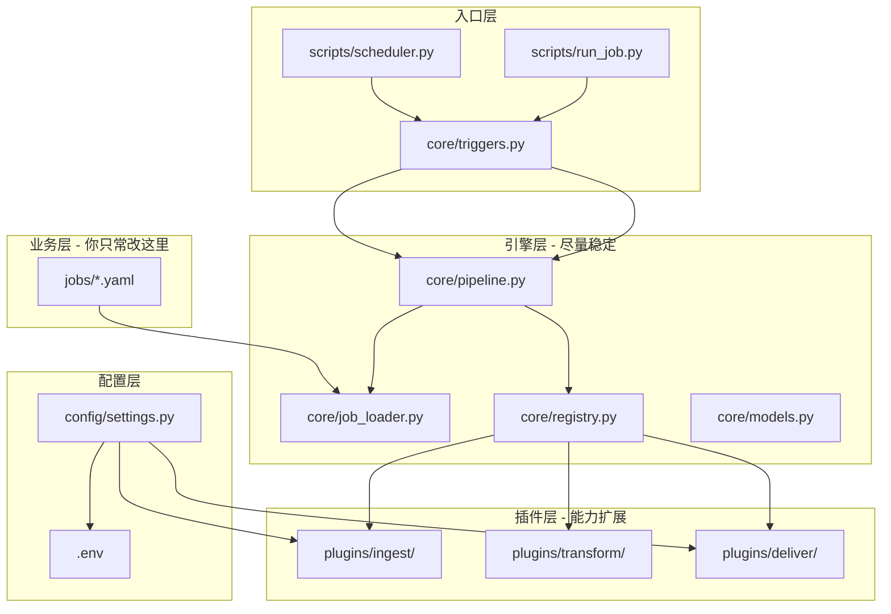
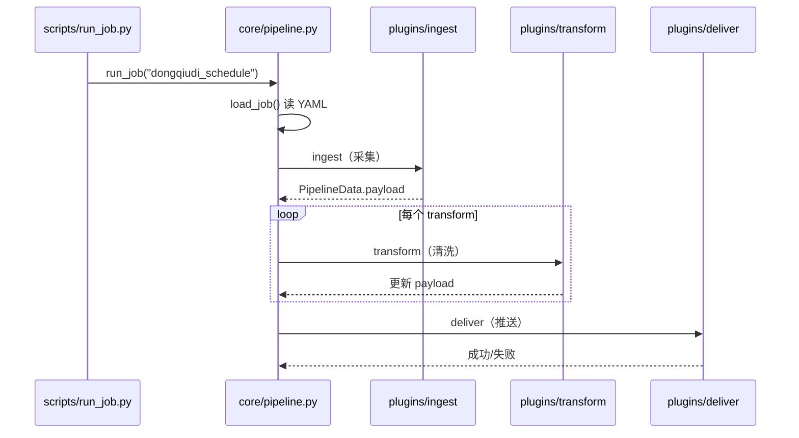
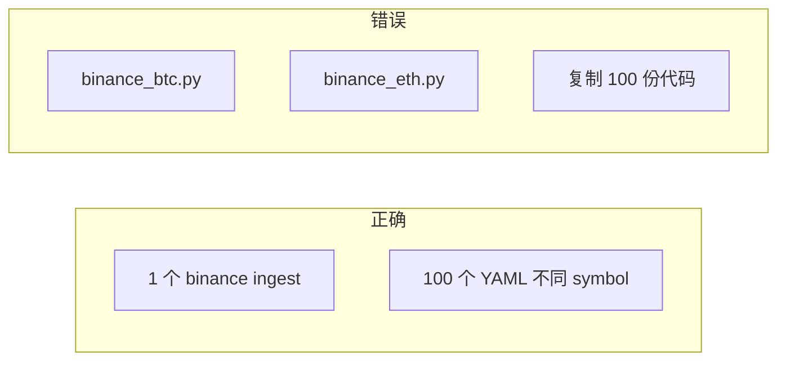

# Datalane 架构与使用指南

产品名 **Datalane**（数据车道）：把「从哪里拿数据 → 怎么洗 → 发到哪里」拆成固定流水线，业务只改配置、少改核心代码。

---

## 一、文件夹之间什么关系

可以记成四层：**配置 → 引擎 → 插件 → 业务任务**。



| 目录 | 角色 | 你会改吗？ |
|------|------|------------|
| `config/` | 读 `.env`，全局 Token、URL、路径 | 加新密钥时改 |
| `core/` | 跑流水线、加载 YAML、注册表 | 很少改 |
| `plugins/` | 具体能力：爬虫、清洗、发送 | **加新业务时改** |
| `jobs/` | 用 YAML **拼装** 一条业务 | **最常改** |
| `scripts/` | 命令行、定时入口 | 偶尔改 |
| `data/` | 运行输出（CSV/TXT） | 自动生成 |
| `legacy/` | 旧命令转发，勿写逻辑 | 不用管 |

**关系一句话**：`scripts` 触发 → `jobs/*.yaml` 说明用哪些插件 → `core/pipeline` 按顺序调用 `plugins` → 配置来自 `config` + `.env`。

---

## 二、架构逻辑：一条 Job 怎么跑

### 1. 固定三步（Pipeline）



核心入口：`core/pipeline.py` 中的 `run_job()`：

1. `load_job(job_id)` 读取 `jobs/<job_id>.yaml`
2. 调用 **ingest** 插件，得到 `PipelineData`（内部是 `payload` 字典）
3. 按顺序执行 **transform** 插件列表
4. 若 `deliver=True`，执行 **deliver** 插件

关键数据结构（`core/models.py`）：

- **`PipelineData`**：各步骤共享的 `payload`（如 `text`、`html`、`summary`、`start`、`end`）
- **`JobContext`**：本次运行的 CLI 参数（`--start` 等）、是否推送（`deliver`）

### 2. 插件注册（Registry）

`core/registry.py` 维护四张表：`INGEST`、`ASYNC_INGEST`、`TRANSFORM`、`DELIVER`。

插件文件使用装饰器注册，例如：

```python
@register_ingest("dongqiudi")
def ingest_dongqiudi(params, ctx):
    ...
```

`import plugins` 时会加载所有子模块，名字必须与 YAML 里 `plugin:` 字段一致。

### 3. 业务配置（Job YAML）

**懂球帝赛程**（`jobs/dongqiudi_schedule.yaml`）：

```yaml
ingest:
  plugin: dongqiudi
transform: []
deliver:
  plugin: telegram_long_text
```

**网页监控**（`jobs/web_monitor.yaml`）：

```yaml
async_ingest: true
ingest:
  plugin: playwright_web
transform:
  - plugin: keyword_alert
deliver:
  plugin: telegram_alert
```

### 4. 触发方式（Triggers）

| 方式 | 文件 | 场景 |
|------|------|------|
| 手动 CLI | `core/triggers.py` → `run_cli()` | 测试、手动跑 |
| 每天 0 点 | `scripts/scheduler.py` | Python 常驻调度 |
| Windows 计划任务 | `run_daily.bat` | 系统级定时 |

---

## 三、关键代码地图

| 你想理解… | 看这里 |
|-----------|--------|
| 懂球帝怎么抓 | `plugins/ingest/dongqiudi.py` → `fetch_matches_to_files()` |
| 浏览器抓网页 | `plugins/ingest/playwright_web.py` |
| HTML 变纯文本 + 关键词 | `plugins/transform/html_to_text.py` |
| 发 Telegram 长文/警报 | `plugins/deliver/telegram.py` |
| 加载任务配置 | `core/job_loader.py` |
| 默认发到哪个群 | `config/settings.py` → `TELEGRAM_CHAT_ID` |
| 命令行入口 | `scripts/run_job.py` |

当前 **Telegram 默认只有一个 Chat ID**（`.env` 的 `TELEGRAM_CHAT_ID`）。发到其他群需扩展 deliver（见下文）。

---

## 四、现在就想爬赛事

### 前提

1. `.env` 已配置（Token 格式：`数字:密钥`；Chat ID 正确）
2. `pip install -r requirements.txt`

### 立刻抓取 + 推送到默认群

```powershell
cd h:\best-ai-monitor
.\.venv\Scripts\Activate.ps1

python scripts/run_job.py dongqiudi_schedule
```

### 常用变体

```powershell
python scripts/run_job.py --list

python scripts/run_job.py dongqiudi_schedule --start 2026-05-20 --end 2026-05-26

python scripts/run_job.py dongqiudi_schedule --no-deliver

python scripts/run_job.py dongqiudi   # 别名 → dongqiudi_schedule
```

### 输出位置

- `data/matches_时间戳.csv`
- `data/matches_时间戳.txt`
- Telegram：带「📅 懂球帝重要赛事」标题的消息

### 每天自动跑

```powershell
setup_windows_task.bat
# 或
python scripts/scheduler.py
```

---

## 五、币安 API → 发到另一个群（扩展指南）

分四步：**配置 → ingest 插件 → deliver 支持多 chat_id → Job YAML**。

### 1. `.env` 增加

```env
TELEGRAM_CHAT_ID=8383708020
TELEGRAM_CHAT_ID_BINANCE=-1001234567890

BINANCE_API_KEY=
BINANCE_API_SECRET=
```

在 `config/settings.py` 增加对 `TELEGRAM_CHAT_ID_BINANCE` 的读取（可选，非全局必填）。

### 2. 新建 `plugins/ingest/binance.py`

```python
import requests
from core.registry import register_ingest
from core.models import JobContext, PipelineData

@register_ingest("binance_ticker")
def ingest_binance(params: dict, ctx: JobContext) -> PipelineData:
    symbol = ctx.params.get("symbol") or params.get("symbol", "BTCUSDT")
    url = "https://api.binance.com/api/v3/ticker/24hr"
    r = requests.get(url, params={"symbol": symbol}, timeout=10)
    r.raise_for_status()
    data = r.json()
    text = (
        f"{data['symbol']}\n"
        f"最新价: {data['lastPrice']}\n"
        f"24h涨跌: {data['priceChangePercent']}%\n"
        f"成交量: {data['volume']}"
    )
    return PipelineData(payload={"text": text, "symbol": symbol})
```

在 `plugins/ingest/__init__.py` 中 import 该模块。

### 3. 扩展 `plugins/deliver/telegram.py`

为 `send_to_telegram` / `deliver_long_text` 增加可选参数 `chat_id`，或从 YAML `params.chat_id_env` 读取环境变量名。

### 4. 新建 `jobs/binance_price.yaml`

```yaml
id: binance_price
name: 币安行情推送
ingest:
  plugin: binance_ticker
  params:
    symbol: BTCUSDT
transform: []
deliver:
  plugin: telegram_long_text
  params:
    chat_id_env: TELEGRAM_CHAT_ID_BINANCE
    header: "📊 {symbol} 行情"
```

### 5. 运行

```powershell
python scripts/run_job.py binance_price
```

**原则**：换群只改 deliver 配置；换币种只改 YAML 或 CLI 参数，不复制爬虫文件。

---

## 六、未来有 100 个任务如何扩展

### 阶段 A：约 20 个任务（当前架构足够）

| 做法 | 说明 |
|------|------|
| 1 Job = 1 个 YAML | `jobs/task_xxx.yaml` |
| 复用插件 | 100 个任务可能只需十余个 ingest、数个 deliver |
| 参数进 YAML | symbol、URL、日期写在 `params` |
| 定时 | 多条 cron / 多个 Windows 计划任务 |

建议目录：

```text
jobs/
  sports/dongqiudi_schedule.yaml
  crypto/binance_btc.yaml
  monitor/web_monitor.yaml
```

可扩展 `job_loader.py` 支持 `jobs/**/*.yaml`。

### 阶段 B：约 100 个任务（要运维能力）

| 组件 | 作用 |
|------|------|
| SQLite / Postgres | 任务定义、运行历史、变更检测 |
| Celery / APScheduler | 分布式执行、重试 |
| Prefect / Dagster | 可视化、日志 |
| 配置中心 | DB 或 UI 管理任务启停 |

Pipeline 模型不变，只是 **Trigger** 从手写 cron 升级为调度中心。

### 阶段 C：扩展原则



- **加任务**：优先只加 `jobs/*.yaml`
- **加能力**：才加 `plugins/` 新插件
- **少改** `core/pipeline.py`

---

## 七、需求与模块对照

| 需求 | Datalane 对应 |
|------|----------------|
| 自动搜索下载文件 | 新 `ingest/file_download` + `transform/pandas_clean` |
| 固定格式发 TG/WA | `deliver/telegram`；WA 见 `deliver/whatsapp.py`（预留） |
| 爬网发群 | `playwright_web` + `telegram_*` |
| 监控数据变化 | transform 对比历史，变化才 deliver |
| 业务分析 | `analytics/` 或导出 `data/` |

---

## 八、速查命令

```powershell
python scripts/test_setup.py
python scripts/run_job.py --list
python scripts/run_job.py dongqiudi_schedule
python scripts/run_job.py web_monitor
```

---

## 九、相关文档

- [FILE_MAP.md](FILE_MAP.md) — 文件路径对照
- [../README.md](../README.md) — 快速开始
